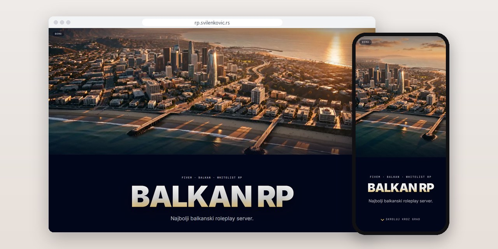
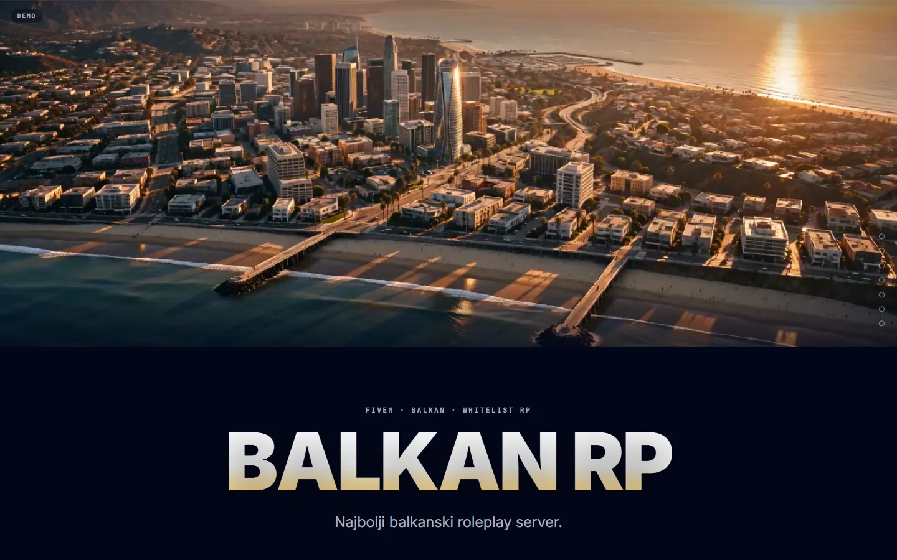
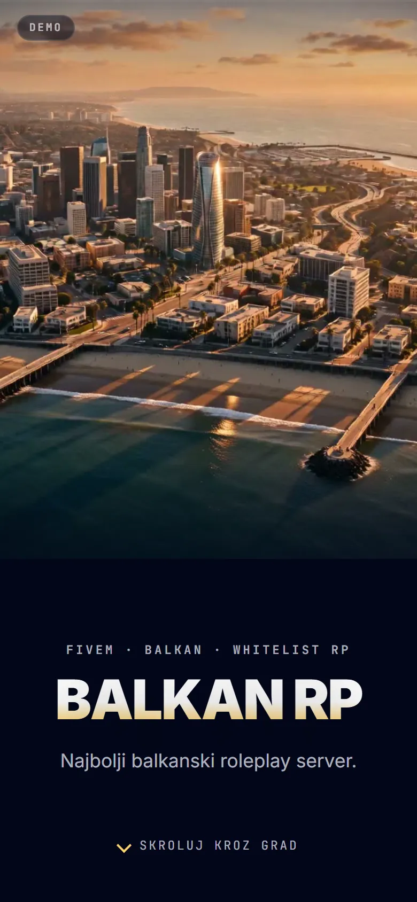
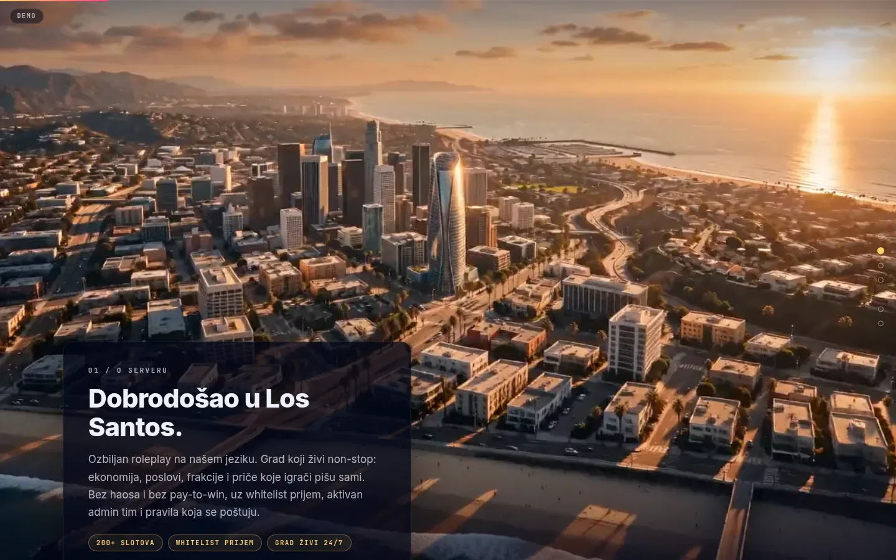
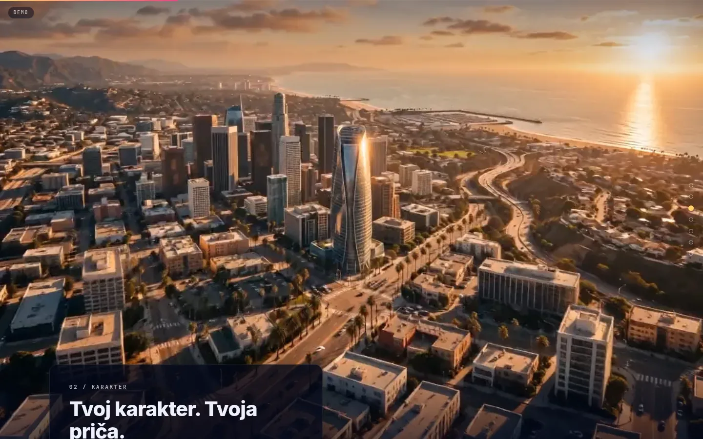

# Balkan RP

Demo for a fictional FiveM roleplay server: the whole page is one continuous, scroll-driven flight through a city in seven chapters.

**[rp.svilenkovic.rs](https://rp.svilenkovic.rs/)** · [Case study (in Serbian)](https://svilenkovic.com/radovi/balkan-roleplay) · [Srpski](README.sr.md)

> [!NOTE]
> My own demo. The source code is private. This page describes the idea and how it is built.

<table>
  <tr><td><b>Client</b></td><td>Own demo</td></tr>
  <tr><td><b>Industry</b></td><td>FiveM roleplay community (fictional)</td></tr>
  <tr><td><b>Location</b></td><td>Serbia</td></tr>
  <tr><td><b>Type</b></td><td>Scroll-driven video website</td></tr>
  <tr><td><b>My role</b></td><td>Concept, design, development and hosting</td></tr>
  <tr><td><b>Stack</b></td><td>Vanilla JS, CSS, ffmpeg, nginx</td></tr>
</table>

## About the project

Balkan RP is a demo for a roleplay community on FiveM, the GTA V mod for private servers. The server does not exist, and the site says so: a DEMO badge sits in the corner of every page and the terms open with that fact. The audience is real, though. Players look at game graphics every day, so the first impression had to be the city itself.

An earlier version used a Three.js scene in which one module alone weighed 934 KB. I replaced it with a 16-second flight through a city with no cuts. Seven chapters slide over it, and the accent colour moves with the film from day to night. On load the page picks one of three modes: video scrubbing on devices with a mouse, 161 WebP frames on a canvas for touch screens, and a plain page with a poster when data saver or reduced motion is on.

## What I built

- Three hand-written files and no build step: one HTML file, about 10 KB of CSS and about 5 KB of JavaScript
- A scroll track of 1050vh on wide screens and 800vh on phones, with the last chapter pinned to the bottom so it never slides past the end of the film
- Seven-dot navigation and a progress bar taken from the same position in the film, so the two cannot drift apart
- A film encoded with every frame as a keyframe and lightly denoised, with a CSS grain layer that brings the texture back
- Versioned file names with a one-year immutable cache, range requests and two film sizes, about 20 MB and 9.5 MB
- A fix for a crash that happened only on phones: the call that schedules loading for idle time got a number where it expects an object with a timeout

## Screenshots

<table>
  <tr>
    <td width="68%" valign="top"></td>
    <td width="32%" valign="top"></td>
  </tr>
</table>

01 / About the server: "Dobrodošao u Los Santos." (Welcome to Los Santos) over a film still

02 / Character: a chapter card with tags describing the content

---

Built by [D. Svilenković](https://svilenkovic.com).
